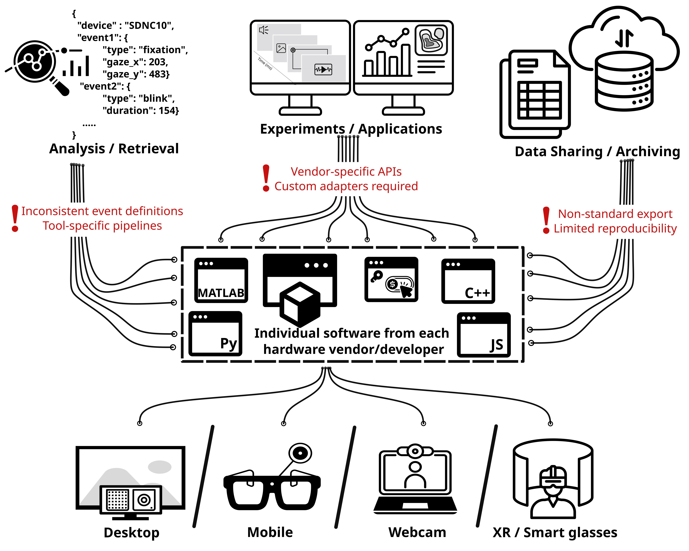
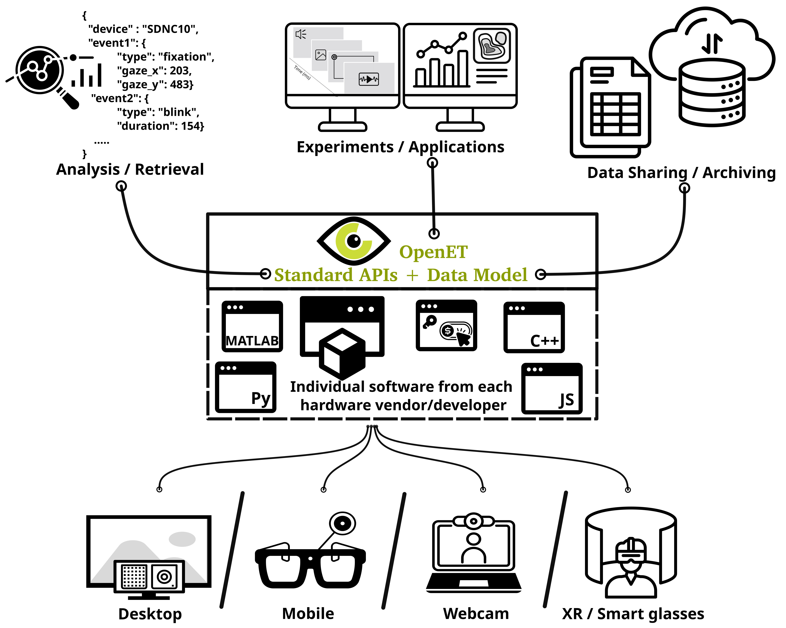

# Welcome to OpenET

OpenET addresses a long-standing fragmentation problem in the eye-tracking ecosystem, where researchers and developers must navigate a complex landscape of device-specific SDKs, programming languages, and incompatible data formats. Currently, integrating multiple eye trackers into a single experimental or analytical pipeline requires substantial custom engineering effort, often resulting in duplicated work and reduced reproducibility.

## Motivation

We’re not the first to attempt this—many great community contributions have already worked to tackle fragmentation in eye tracking. Researchers and developers have built [Lab Streaming Layer](https://github.com/mit-ll/Signal-Acquisition-Modules-for-Lab-Streaming-Layer) adapters for different eye trackers, created [Eye-tracking-BIDS](https://github.com/bids-standard/eye2bids) adapters for systems like EyeLink, and developed plugins to connect devices with experiment builders such as PsychoPy and jsPsych. However, these efforts are tied to specific hardware and/or experimental setups. The goal of OpenET is to bring these contributions together and converge like-minded people and thought leaders towards developing an interoperable standard that works across eye-tracking devices and procedures.

## How do we aim to solve the fragmentation problem?

OpenET introduces a unified approach built on three core components: a shared data schema, and a set of interoperable REST and asynchronous APIs. The schema defines a common structure for representing eye-tracking data—such as gaze vectors, pupil metrics, timestamps, and calibration metadata—ensuring consistency across devices. On top of this schema, REST APIs enable on-demand access to eye-tracking data, while asynchronous APIs support real-time streaming for interactive and time-sensitive applications.

## Developers' statement

The proposed standard builds on a strong foundation of existing open standards that make OpenET possible. We gratefully acknowledge the communities behind [OpenAPI](https://www.openapis.org/), [AsyncAPI](https://www.asyncapi.com/en), and [JSON Schema](https://json-schema.org/community), whose descriptive frameworks underpin this work. We’re fortunate to be in a time where these standards exist, making it possible to conceptualise and build a higher-level standard for eye tracking.

Just how it helps openET to be able to use the work from all these different fields, we also recognise the difficulty it brings to a new user/reader in parsing everything here. We strive to keep OpenET as accessible as possible and actively welcome contributions through our open governance model. If something feels unfamiliar or difficult, we encourage you to see it as an opportunity to learn and engage with others—and to help others in return. In the end, we just want to make sure the initiative is community-driven and leaves no one behind. 

## Get involved

💬 Join discussions and share feedback

🛠️ Propose changes or improvements

👥 Participate in the OpenET Working Group

